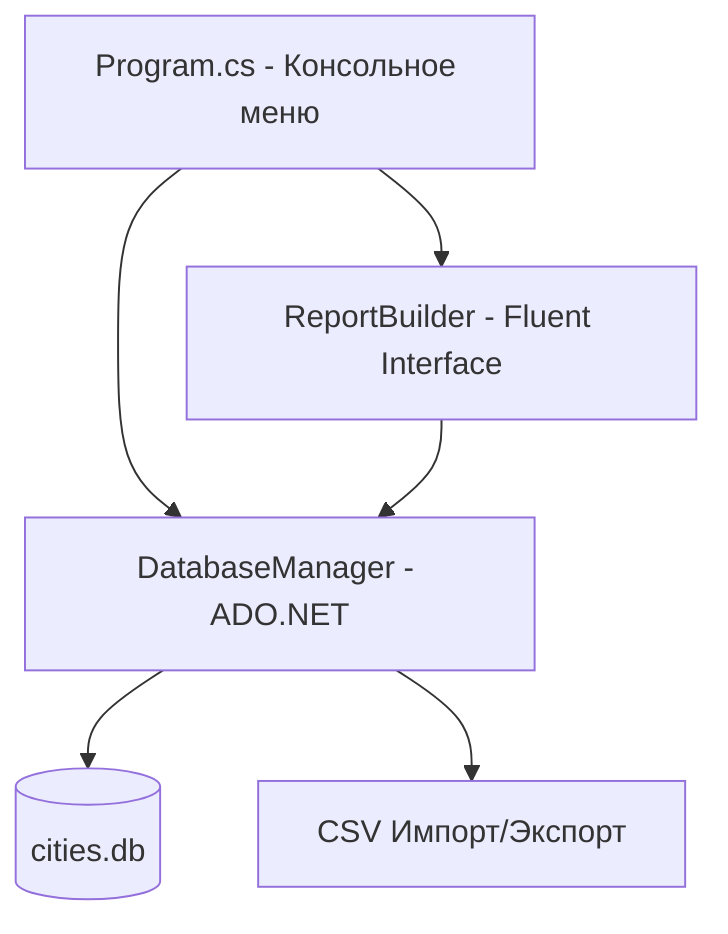

# Проект «Страны и города» — Домашнее задание 2

Проект представляет собой консольное C#-приложение (.NET 8.0/10.0), реализующее функции реляционной СУБД для управления справочником стран и основной таблицей городов с показателями численности населения.

Вся работа с базой данных SQLite реализована на базе **прямого взаимодействия через ADO.NET** (`Microsoft.Data.Sqlite`) с ручным написанием SQL-запросов и параметризацией.

Отличительной особенностью проекта является построение форматированных текстовых отчетов на базе паттерна **Fluent Interface (текучий интерфейс)**.

---

## 🛠️ Технологический стек

* **Язык**: C# 12 / .NET 8.0/10.0
* **База данных**: SQLite
* **Доступ к данным**: ADO.NET (`Microsoft.Data.Sqlite`) с поддержкой целостности внешних ключей (`PRAGMA foreign_keys = ON`)
* **Шаблоны проектирования**: Fluent Interface (в генераторе отчетов `ReportBuilder`)
* **Интерфейс пользователя**: Интерактивное консольное меню (CLI)
* **Формат обмена**: Экспорт и импорт таблиц в формате CSV (разделитель `;`).

---

## 📐 Архитектура системы



### 1. Модель данных
- **`Country`**: Справочник стран (сторона "один"). Поля: `Id` (PK), `Name`.
- **`City`**: Основная таблица городов (сторона "много"). Поля: `Id` (PK), `CountryId` (FK), `Name`, `PopulationK`.
  * Валидация: В свойстве `PopulationK` реализована проверка `value < 0`, выбрасывающая `ArgumentException`.
- **`CsvRow`** и **`CsvTable`**: Легковесные структуры (`record`) для передачи нетипизированных результатов SQL-запросов генератору отчетов.

### 2. Слой доступа к данным (`DatabaseManager.cs`)
* Выполняет `CREATE TABLE` для стран и городов с поддержкой ограничений `CHECK (population_k >= 0)` и `FOREIGN KEY`.
* Реализует CRUD-операции на базе параметризованных команд (`SqliteCommand`) для предотвращения SQL-инъекций.
* Автоматически импортирует начальные данные из CSV-файлов при первом создании базы.
* Поддерживает экспорт таблиц обратно в CSV.

### 3. Текучий интерфейс отчетов (`ReportBuilder.cs`)
Паттерн **Fluent Interface** позволяет конструировать сложные текстовые отчеты в виде цепочки легкочитаемых вызовов:
```csharp
new ReportBuilder(db)
    .Query("SELECT ...")
    .Title("Заголовок отчета")
    .Header("Колонка 1", "Колонка 2")
    .ColumnWidths(20, 15)
    .Numbered()
    .Footer("Всего записей")
    .Print(); // или .SaveToFile("path.txt")
```
**Возможности `ReportBuilder`**:
- Автоматический расчет ширины колонок или применение пользовательских настроек с корректной обрезкой слишком длинного текста (с добавлением символа `~`).
- Опциональная сквозная нумерация строк (`.Numbered()`).
- Автоматический подсчет количества строк и вывод в подвал отчета (`.Footer()`).
- Вывод в консоль или сохранение отформатированного отчета в файл.

---

## 🖥️ Консольное меню (Интерфейс)

Интерактивное меню CLI предоставляет полный доступ ко всем функциям системы:
1. **Показать все страны**: Вывод содержимого справочника.
2. **Показать все города**: Вывод списка городов.
3. **Добавить город**: Ввод имени, населения и выбор страны из справочника.
4. **Редактировать город**: Изменение полей города с выводом текущих значений по умолчанию при нажатии `Enter`.
5. **Удалить город**: Удаление города по ID с подтверждением.
6. **Отчеты**: Подменю со следующими отчетами:
   - *Отчет 1*: Полный список городов с названиями стран (сортировка по названию города).
   - *Отчет 2*: Количество городов в каждой стране (`GROUP BY` и `COUNT`).
   - *Отчет 3*: Среднее население городов по странам (`GROUP BY` и `AVG`, сортировка по убыванию среднего).
   - *Экспорт*: Сохранение отчета 1 в файл `cities_report.txt`.
7. **Фильтр по стране**: Вывод городов выбранной страны.
8. **Экспорт в CSV**: Выгрузка актуальных данных таблиц в файлы `country_export.csv` и `city_export.csv`.
9. **Добавить страну**: Внесение новой страны в справочник.
10. **Удалить страну**: Удаление страны по ID. Система корректно перехватывает ошибки ограничений внешнего ключа SQLite и запрещает удаление стран, в которых еще есть города.

---

## 🚀 Инструкция по сборке и запуску

Приложение кроссплатформенно и собирается стандартными средствами .NET SDK.

### 1. Сборка решения
```bash
dotnet build DZ2_ASOIU.sln
```

### 2. Запуск приложения
При установленном .NET 8.0 SDK:
```bash
dotnet run --project DZ2_ASOIU/DZ2_ASOIU.csproj
```
При запуске в среде с .NET 10.0 (с использованием механизма roll forward):
```bash
DOTNET_ROLL_FORWARD=Major dotnet run --project DZ2_ASOIU/DZ2_ASOIU.csproj
```

---

## 📂 Структура файлов проекта

* `DZ2_ASOIU/Country.cs` — Класс справочника стран.
* `DZ2_ASOIU/City.cs` — Класс основной таблицы городов с валидацией.
* `DZ2_ASOIU/CsvTable.cs` — Структуры данных для динамических отчетов.
* `DZ2_ASOIU/DatabaseManager.cs` — ADO.NET-логика, работа со SQLite и CSV.
* `DZ2_ASOIU/ReportBuilder.cs` — Паттерн Fluent Interface для построения текстовых отчетов.
* `DZ2_ASOIU/Program.cs` — CLI-меню и обработка пользовательского ввода.
* `DZ2_ASOIU/country.csv` и `city.csv` — CSV-файлы для начальной инициализации БД.
